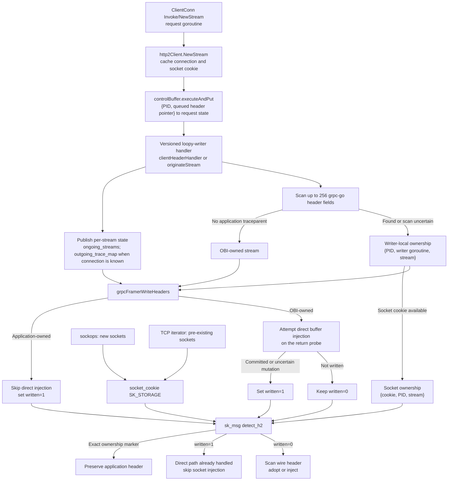

# gRPC/HTTP2 Context Propagation

Builds on the general [Context Propagation Architecture](context-propagation.md).

## Overview

Injects `traceparent` HPACK headers into outgoing HTTP/2 HEADERS frames and parses them on the receiving side.

**HPACK is the only network mechanism for gRPC/H2 CP.** TCP options are explicitly not used — see [Why not TCP options](#why-not-tcp-options).

Cross-process propagation is network-only.

## Egress

### sk_msg Injection Chain

```
obi_packet_extender
  └─ detect_h2           — find HEADERS frame, extract stream_id
       └─ find_existing   — check if traceparent already exists in HPACK
            └─ create_tp  — look up parent from outgoing_trace_map[{ports, stream_id}]
                 └─ write_tp — push 69 bytes of HPACK via bpf_msg_push_data
```

H2 detection: the `sk_h2_conn_flag` socket storage holds a state machine (`none → preface → confirmed | rejected`, auto-freed on socket close). A `PRI *` preface followed by SETTINGS confirms; a non-SETTINGS first frame rejects (yamux protection, #2734). Connections whose preface predates OBI attachment can never see a preface, so `wrap_http2_traceparent` runs a strict RFC 7540 mid-stream sniff (`h2_sniff_*` in `h2_defs.h`): frames must tile the buffer exactly, HEADERS on an odd stream, per-type flag/length rules, and every HEADERS block must open with a pseudo-header. A sniff pass sets `confirmed` directly. Response blocks pass the sniff and latch `k_h2_sk_server`: the socket is HTTP/2 either way, and rejecting it there would leave every server-side connection re-sniffing on every packet. Whether the frame may be injected is a separate question, answered by `h2_inject_verdict`. Connections the generic tracer tracked as SSL are never sniffed — a false positive would splice HPACK into ciphertext. Scans up to 4 frames for HEADERS with `END_HEADERS`. PADDED/PRIORITY flags shrink the HPACK window inside the payload; `detect_h2` accounts for both.

`detect_h2` is resumable across tail calls via `tailcall_ctx.h2_scan_pos`. After `write_h2_tp` injects HPACK into a frame, it tail-calls `detect_h2` with `scan_pos` past the just-injected frame so multiplexed senders that batch multiple HEADERS frames into one `sendmsg` (Node grpc-js, Go loopyWriter under contention) get every stream injected. Bounded by `k_h2_max_frames_per_packet` (4) within the 33 tail-call budget: 7 hops per frame at worst, `2 + 4*7 = 30`.

Before injecting, `h2_inject_verdict` (`tpinjector/inject_policy.h`) decides eligibility from the frame's opener byte, the socket direction, the Go uprobe handshake and what the HPACK scan found. Both `detect_h2` (direction) and `create_h2_tp` (content) call it, so the two stages cannot disagree. The opener is the first HPACK *field* byte — any leading dynamic table size updates (RFC 7541 6.3, emitted whenever the peer advertises `SETTINGS_HEADER_TABLE_SIZE`) are skipped first, otherwise a legal request block reads as "not a request".

Injection requires *proving* the block carries no traceparent, not merely failing to find one: a second field makes receivers discard both. `k_h2_skip_unscanned` covers a block longer than `k_h2_max_hpack_scan` and a scan that ran out of retries.

#### Socket mutation transaction

`write_h2_tp` treats one HEADERS-frame splice as a transaction. It first builds the complete HPACK field in per-CPU scratch memory and validates the original message size, insertion offset, frame-length field, maximum frame size, and linearization. None of those checks changes the message.

The mutation sequence and failure outcomes are:

| Boundary | Message state on failure | Outcome |
|----------|--------------------------|---------|
| Preflight length-field pull and read | Original | Pass unchanged |
| `bpf_msg_push_data` | Original when the helper rejects the push | Pass unchanged |
| Post-push HPACK pull or bounds check | Resized, original frame length | Pop and verify rollback |
| Frame-length pull or bounds check | Resized with HPACK written, original frame length | Pop and verify rollback |
| First rollback pop or pull | Restoration is not yet verified | Retry and verify rollback |
| Repeated rollback helper failure or failed restoration readback | Restoration is uncertain | Drop the message; never pass uncertain bytes |

Dropping after an uncertain rollback makes the application's socket write fail, and callers should discard the connection. This is preferable to passing a possibly resized or partially rewritten HTTP/2 frame to the peer. Verified rollback still passes the original bytes unchanged.

The socket-message commit point is the store of the new three-byte frame length after the inserted HPACK bytes have been written. No fallible socket helper or message-memory write runs after that point. The checked `outgoing_trace_map` update that publishes `written=1` follows as bookkeeping and cannot change the committed wire bytes. A rollback is successful only when `bpf_msg_pop_data` succeeds, `msg->size` equals the original size, and the restored frame length reads back exactly. Helper success alone is not treated as proof of restoration. The transaction does not read back ordinary message-memory writes because no operation can change those bytes between the store and the read.

`bpf_msg_pop_data` is an upstream Linux 5.0 helper, but OBI selects by capability rather than the reported release. At load time, the cilium/ebpf feature probe asks the running kernel verifier whether `BPF_PROG_TYPE_SK_MSG` may call it. This detects both Linux 5.8+ support and RHEL-family 4.18 backports without attaching a program to a socket. If the helper probe fails, the loader replaces `write_h2_tp` with a verifier-safe program that only resumes frame scanning and never calls push, pull, pop, or writes message memory. Host tests exercise rollback boundaries by failing the socket helpers directly; a privileged test verifies exact mutation bytes and same-peer continuity with a transient loopback `SK_MSG` program.

The scan recognizes the encodings that put identifying bytes on the wire: a literal name in any of the three literal prefixes, plain or huffman, and a dyn-table name reference whose value is plain (`0x37` + `00-` + dash positions). On egress a compressed value still counts only as *present*, not adoptable; ingress decodes it.

Some encodings leave nothing at all: a dyn-table name reference with a compressed value, or — when a sender repeats the *same* traceparent, as a service fanning one incoming context out to several downstream calls — a single index byte standing for the whole field. Measured on grpc-js: request 1 is a 74-byte block holding `40 88 <huffman traceparent> a5 <huffman value>`, requests 2-4 are 25 bytes with no trace of it.

No content scan can see those, and none needs to. An index only exists because the encoder inserted the entry, and at insertion time the name was on the wire in full — so matching the name once and latching `k_h2_sk_app_tp` on the socket covers every later reference to it exactly, with no table state and no guesswork. OBI then stands down on that socket for good.

Two consequences follow, and both are properties of the rule rather than gaps in it. A socket shared between callers that propagate and callers that do not loses injection for the quiet ones — chosen deliberately, since a second field voids the header for the whole downstream chain. And a connection whose insertions predate attachment has a table OBI never watched being built, so a traceparent already reduced to an index there is invisible; that case is bounded by `k_h2_skip_unscanned` only when the block is too long to walk, not when it is short and opaque.

Parent lookup priority in `create_tp`:

1. `outgoing_trace_map[{ports, stream_id}]` — written by Go uprobe or kprobe CLIENT
2. `find_parent_trace` — general fallback chain: Node.js → Python → nginx → Puma → Java → process traces → `cp_support_connect_info`

### Go Uprobe Path

1. **`transport_http2Client_NewStream`** — caches `{pid, conn_ptr} → {connection_info, socket_cookie}` in `grpc_conn_ptr_to_conn`. The socket cookie comes from the Go connection's `netFD.pfd.Sysfd` and the current task's file table.
2. **`controlBuffer.executeAndPut` → versioned loopy-writer handler** — carries the request across the caller-to-writer goroutine handoff using `{pid, queued_header_ptr}`. Current grpc-go uses `clientHeaderHandler` with `*clientHeaders`; grpc-go 1.56.3 uses `originateStream` with `*headerFrame`. The matching atomic probe group publishes the stream state before serialization, so it does not depend on `NewStream` returning first, and combines the assigned stream ID with the cached socket cookie when one is available. It also scans the handler's HPACK field slice once for an application-provided `traceparent`. Writer-local ownership does not require connection metadata; when a socket cookie is available, the handler also publishes the exact `{socket_cookie, pid, stream_id}` ownership marker used by socket fallback. The value is not copied or validated: field ownership alone prevents OBI from adding a duplicate. The scan examines up to 256 fields. Longer or unreadable slices are conservatively treated as application-owned, preserving application data at the cost of skipping OBI injection for that stream. Unknown layouts do not partially attach ownership probes.
3. **`grpcFramerWriteHeaders`** — has both stream_id and trace context. It stands down when the current writer goroutine observed an application field for that stream; otherwise it writes `outgoing_trace_map[{ports, stream_id}]`, marks the conn via `mark_go_grpc_client_conn`, and injects traceparent via `bpf_probe_write_user` when `g_bpf_header_propagation` is true. The stand-down path also marks the outgoing entry written, so socket fallback remains suppressed if socket-cookie storage is unavailable.



### sk_msg Per-Stream Fallback for Go gRPC Conns

Once a conn is marked, `obi_packet_extender` (sk_msg) checks `is_go_grpc_client_conn` first: pulls the data, populates `msg_buffers` for the `tcp_sendmsg` kprobe, sets `tailcall_ctx.go_grpc_conn` and tail-calls `detect_h2`. No TCP option scheduling. Sockops records each established socket's cookie in shared `SK_STORAGE`; the TCP iterator does the same while backfilling pre-existing connections. On a HEADERS frame, `sk_msg` consumes an application-ownership marker only when that stored cookie, the sending PID, and the frame's stream ID all match. This is identity- and lifecycle-based: no timeout decides whether a marker is trustworthy.

For streams OBI owns, the chain then honors the `written` handshake: `written=1` means the uprobe's user-buffer HPACK already carries a traceparent — either the application's field or OBI's committed write — so the socket path skips the frame. `written=0` means the uprobe write failed or went unconfirmed; the wire scan adopts an on-wire traceparent if one is found, otherwise `create_h2_tp` injects the stored tp. Streams with no stored tp at all are never touched on a Go conn (`go_grpc_conn` guard). The selected current or legacy handler publishes a tp for every supported client stream before serialization; TLS is kept out by the socket state machine instead — ciphertext has no preface and cannot pass the mid-stream sniff, so `detect_h2` never runs on it. HTTP/1 traffic from the same Go process is unmarked and goes through the HTTP/1 detection path.

## Ingress

- **kprobe HPACK parser** (`http2_grpc_start`, SERVER side): parses HPACK first (per-stream, immune to per-connection trace_map race on multiplexed streams), bounded to the actual frame payload length so trailing batched HEADERS aren't adopted, with PADDED/PRIORITY shrink applied. Falls back to `find_trace_for_server_request` only if HPACK parsing finds no traceparent. Requests 2+ on a persistent connection carry `traceparent` as an HPACK dyn-table indexed name — no literal name on the wire — so the server finalize stage additionally runs `find_hpack_traceparent_value` (value fingerprint: `0x37` length byte + `00-` prefix + dash positions + hex spot-checks). That scan lives in its own tail-call program (`..._server_finalize` → `..._server_commit`, jump table slot 14): sharing a program with the commit body exceeds the verifier's 1M-instruction ceiling on kernels 6.12+
- **Huffman values**: SDKs usually huffman-compress the traceparent value — 35 octets on the wire instead of 55 — so none of the plain-text scans above can read it. Decoding is cheap because the traceparent alphabet is tiny: every character it can contain (`0-9a-f-`) has a 5- or 6-bit code in RFC 7541 Appendix B, so reading 6 bits is always enough to identify the next character, and `h2_tp_huffman.h` does exactly that with a single 64-entry lookup table. The table doubles as the validator: 41 of its slots name no traceparent character, so decoding anything else hits an empty slot and rejects. The EOS prefix lands on slot `0x3f`, so encoded EOS rejects the same way.

  The work spans three stages because a decode loop nested inside the HPACK scan is too much for one BPF program:

  1. The scan only *records* where a compressed value sits (`h2_tp_huff_candidate_t`).
  2. `..._server_huffman` (jump table slot 15) decodes it with `bpf_loop`.
  3. `..._server_huffscan` (slot 16) covers the indexed-name case: a dyn-table name reference leaves no name on the wire to match, so this program sweeps the block for a plausible compressed value on its own. Its verdict ranks above `find_trace_for_server_request` — a successful decode is self-validating — while the weaker plain value fingerprint in finalize stays below it.

  `bpf_loop` puts the feature's kernel floor at **5.17**. On older kernels `g_bpf_loop_enabled` is false, the decode never runs, and ingress keeps its existing fallbacks.
- **Go uprobe** (`http2Server_operateHeaders` + `server_handleStream`): writes parsed traceparent to `ongoing_grpc_server_stream_tps[{tr_ptr, stream_id}]`. `handleStream` reads per-stream first, falls back to the legacy `ongoing_grpc_transports` per-transport entry. Per-stream key avoids the last-writer-wins race when the same transport carries concurrent streams

## Parent Trace Linking

`outgoing_trace_map` is keyed by `egress_key_t = {s_port, d_port, stream_id}`. The `stream_id` isolates concurrent multiplexed streams on the same connection.

Writers:

- **Go uprobes** (`loopyWriter.clientHeaderHandler` or legacy `originateStream`, plus `grpcFramerWriteHeaders` entry) — `BPF_ANY` with `written=0`; application ownership or a committed direct write flips it to `written=1`. A failed or uncertain direct write leaves socket fallback enabled.
- **kprobe CLIENT** (`http2_grpc_start`) — `BPF_NOEXIST` with `written=0`, used only when no uprobe wrote first; span_id comes from `urand_bytes`
- **sk_msg** (`find_existing_h2_tp` / `create_h2_tp`) — `BPF_ANY`, used by non-Go senders. Persists the traceparent that was just written onto the wire so kprobe CLIENT can adopt the same context

`adopt_injected_trace`: called after `find_trace_for_client_request` in the kprobe CLIENT path. Overrides stale traces with whatever is in `outgoing_trace_map[{ports, stream_id}]`.

### Cleanup

`http2_grpc_end` (kprobe stream end) deletes `outgoing_trace_map[{ports, stream_id}]` for that stream. The connection-scoped `delete_client_trace_info` only clears the `stream_id=0` entry, so without per-stream cleanup the per-stream entries leak until LRU eviction.

Each ownership stage has one forward entry, owned by the consumer that can determine when it is no longer needed, and a request-keyed reverse entry used only for bookkeeping. The selected loopy-writer handler consumes `pending_h2_invocations`; its return probe clears `grpc_h2_header_observations` and `grpc_app_owned_writes`; and `sk_msg` consumes `grpc_h2_owned_streams` when the exact socket cookie, process, and stream ID reach the wire.

Request completion or cancellation deletes only `grpc_pending_header_by_request`, `grpc_owned_writer_by_request`, and `grpc_owned_stream_by_request`. It deliberately leaves the corresponding forward entries for a queued writer, active writer, or socket path to consume, because those consumers can run after the request goroutine completes. Forward entries that never reach their consumer remain bounded by their LRU maps.

## Why not TCP options

HTTP/1 CP uses TCP option kind 25 (`schedule_write_tcp_option` → sock_ops `write_hdr_cb`) as a robust per-connection channel for `trace_id`+`span_id`. gRPC/H2 deliberately does not.

**Multiplexing.** A single H2 connection carries many concurrent streams, each with its own trace context. TCP option kind 25 is **connection-scoped**: a single 24-byte payload carrying one `trace_id`+`span_id`. It cannot represent N distinct per-stream contexts. The first stream's context "wins" and all other streams on the same connection get the wrong context via TCP option. HPACK is per-frame and naturally per-stream.

**Enforcement.** `handle_existing_tp_pid` in `bpf/tpinjector/tpinjector.c` gates the TCP-option schedule on `!is_h2_socket(msg)`. The H2 tail-call chain (`detect_h2` → `find_existing_h2_tp` → `create_h2_tp` → `write_h2_tp`) never calls `schedule_write_tcp_option`, and the Go gRPC branch (`is_go_grpc_client_conn`) enters that chain directly, also without scheduling.

## Known Limitations

### Method names on pre-existing non-Go connections

Connections established before OBI attached are recognized (mid-stream sniff), produce spans, and propagate context — but on non-Go services the span name degrades to `*`. Requests 2+ on a persistent connection encode `:path` as a bare HPACK dynamic-table index; the literal string crossed the wire only in a request sent before attach, so no wire observer can recover it. The userspace per-connection HPACK mirror (`bhpack`, one decoder per direction in `http2grpc_transform.go`) resolves indices only for connections observed from their first byte — attaching mid-stream, its insertion history diverges from the peer's real table, so even post-attach literals cannot safely resolve later indexed references and the decoder refuses rather than guesses.

`traceparent` is unaffected (sk_msg re-injects the value literally on every request, and the server-side value-fingerprint scan recovers it). Go services are unaffected (uprobes read the method from process memory).

### Go lazy connect without uprobes

`grpc.NewClient` connects lazily on a background goroutine. Without Go uprobes (`OTEL_EBPF_SKIP_GO_SPECIFIC_TRACERS=true`), `cp_support_connect_info` records the wrong thread and parent lookup fails.

**With uprobes**: Not affected.

### Caller-to-writer handoff

**The race.** When a Go gRPC client opens a new stream, two goroutines are involved:

1. The caller goroutine runs `NewStream`, which builds a queued header object and sends it to the `controlBuffer`.
2. The `loopyWriter` goroutine dequeues that object, establishes the HTTP/2 `stream_id`, and calls `framer.WriteHeaders`.

The direct HPACK injection in `framer.WriteHeaders` looks up the trace context in `ongoing_streams[{pid, conn_ptr, stream_id}]`. `NewStream_ret` populates that map on the caller goroutine, but `loopyWriter` can start serializing the first HEADERS frame before `NewStream` returns. Relying on the return probe alone therefore leaves a race where the lookup misses and no `traceparent` is injected.

**Why the bridge is needed.**

- On the caller goroutine, OBI knows the trace context before a usable stream ID has been assigned.
- On the writer goroutine, grpc-go has assigned the stream ID, but goroutine-keyed state from `NewStream` is no longer visible.

The queued header object's pointer is visible on both sides of the handoff. OBI combines it with the process ID so pointer reuse in another process cannot correlate unrelated requests.

**The bridge** (`bpf/gotracer/go_grpc.c`):

- **`(*controlBuffer).executeAndPut`** — runs on the caller goroutine just before the header object is queued. It stores the invocation in `pending_h2_invocations[{pid, hdr_ptr}]` and records a request-keyed reverse reference.
- **`(*loopyWriter).clientHeaderHandler`** — the current grpc-go path consumes a `*clientHeaders` object after the stream ID has been assigned and before HPACK serialization. It consumes the pending entry, publishes `ongoing_streams[{pid, conn_ptr, stream_id}]` and `outgoing_trace_map`, scans the handler's HPACK fields for application ownership, and records the active writer observation used by `grpcFramerWriteHeaders`.
- **`(*loopyWriter).originateStream`** — the grpc-go 1.56.3 path consumes a `*headerFrame` pending entry once `outStream.id` is available. It publishes the same stream state and application-ownership observation as the current handler. Atomic version selection prevents this layout from attaching when `clientHeaderHandler` is present.

## Maps

| Map | Type | Key | Value | Purpose |
|-----|------|-----|-------|---------|
| `sk_h2_conn_flag` | SK_STORAGE | socket | `u8` | Marks socket as HTTP/2 |
| `ongoing_http2_connections` | HASH | `pid_connection_info_t` | `http2_conn_info_data_t` | H2 connection tracking |
| `outgoing_trace_map` | LRU_HASH | `egress_key_t{ports, stream_id}` | `tp_info_pid_t` | Per-stream sender trace context |
| `incoming_trace_map` | LRU_HASH | `connection_info_t` | `tp_info_pid_t` | Receiver trace context (HTTP/1 path only; gRPC uses per-stream maps) |
| `socket_cookie` | SK_STORAGE | socket | `u64` | Stable socket identity shared by sockops, the TCP iterator, and `sk_msg` |
| `grpc_h2_owned_streams` | LRU_HASH | `{socket_cookie, pid, stream_id}` | `u8` | Exact application-owned Go gRPC streams |
| `grpc_conn_ptr_to_conn` | LRU_HASH | `go_addr_key_t{pid, conn_ptr}` | `grpc_connection_t` | Go conn pointer → TCP ports and socket identity, scoped to one process |
| `grpc_h2_header_observations` | LRU_HASH | `go_addr_key_t{pid, writer goroutine}` | `grpc_h2_header_observation_t{request_key, stream}` | Current header serialization observed by the loopyWriter |
| `grpc_app_owned_writes` | LRU_HASH | `go_addr_key_t{pid, writer goroutine}` | `u32 (stream_id)` | Direct-write ownership within the current loopyWriter call |
| `grpc_owned_writer_by_request` | LRU_HASH | `go_addr_key_t{pid, request goroutine}` | `go_addr_key_t{pid, writer goroutine}` | Reverse reference discarded by the writer return probe or request completion |
| `grpc_owned_stream_by_request` | LRU_HASH | `go_addr_key_t{pid, request goroutine}` | `grpc_h2_owned_stream_key_t` | Reverse reference used to replace a request's socket ownership marker safely |
| `ongoing_grpc_server_stream_tps` | LRU_HASH | `stream_key_t{tr_ptr, stream_id}` | `tp_info_t` | Per-stream parsed traceparent (Go gRPC server) |
| `pending_h2_invocations` | LRU_HASH | `go_addr_key_t{pid, hdr_ptr}` | `pending_h2_invocation_t{inv, request_key, conn_ptr}` | Caller-to-writer bridge consumed by the current header handler or legacy `originateStream` |
| `grpc_pending_header_by_request` | LRU_HASH | `go_addr_key_t{pid, request goroutine}` | `u64 (hdr_ptr)` | Reverse reference discarded when the bridge is consumed or the request completes |
| `go_grpc_client_conns` | LRU_HASH | `pid_connection_info_t` | `u8` | Marks Go gRPC client conns (via `mark_go_grpc_client_conn`); sk_msg bails on `is_go_grpc_client_conn` hit |
